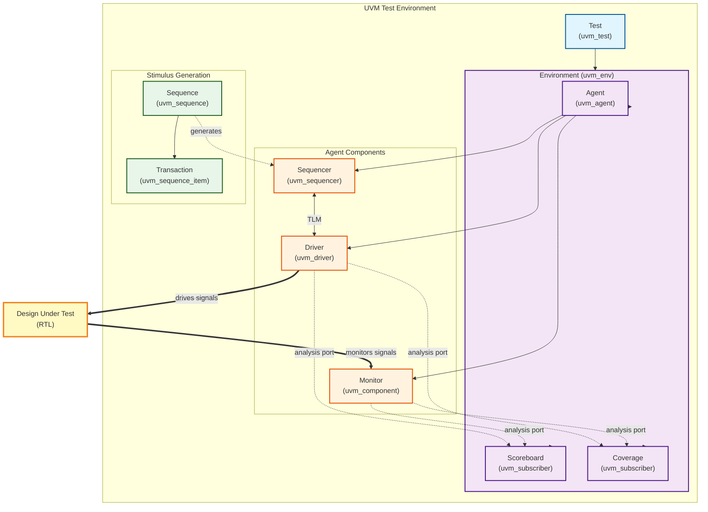

# PyUVM Test Framework Deployment Guide

A step-by-step guide for deploying a complete UVM verification environment using pyUVM and cocotb for Chisel/SystemVerilog designs.

---

## Introduction to UVM Testing

### What is UVM?

The **Universal Verification Methodology (UVM)** is an industry-standard methodology for verifying digital designs. It provides a standardized framework for building reusable, scalable, and modular verification environments. UVM was originally developed for SystemVerilog, but **pyUVM** brings these powerful concepts to Python, making verification more accessible and easier to integrate with modern software practices.

### Why UVM?

Traditional directed testing approaches quickly become unmanageable as designs grow in complexity. UVM addresses these challenges by providing:

- **Standardized architecture** for verification components
- **Reusability** of verification IP across projects
- **Constrained random testing** for better coverage
- **Separation of concerns** between stimulus, checking, and coverage
- **Phased execution** for organized test flow
- **Built-in reporting** and messaging infrastructure

---

## UVM Architecture

The UVM methodology organizes verification components into a clear hierarchy:



### Architecture Diagram Legend

- **Solid arrows (→)**: Hierarchical containment (parent-child relationship)
- **Dotted arrows (⇢)**: Information flow / method calls
- **Bold arrows (⇒)**: Signal-level connections to DUT
- **TLM**: Transaction Level Modeling (analysis port connections)

### Key Components

#### 1. **Transaction (uvm_sequence_item)**

- Represents a single unit of stimulus or response
- Contains data fields (inputs/outputs)
- Can be randomized for constrained-random testing
- **Example**: A GCD transaction with two input values and one output

#### 2. **Sequence (uvm_sequence)**

- Generates streams of transactions
- Encapsulates test scenarios (random, directed, corner cases)
- Reusable across different tests
- **Example**: Random sequence, directed sequence, stress test sequence

#### 3. **Driver (uvm_driver)**

- Converts transactions into pin-level activity
- Drives signals to the DUT
- Handles protocol timing and signal transitions
- **Example**: Sets `io_value1`, `io_value2`, toggles `io_loadingValues`

#### 4. **Monitor (uvm_component)**

- Observes pin-level activity
- Reconstructs transactions from DUT signals
- Sends observed transactions to analysis components
- **Example**: Watches for `io_outputValid` and captures results

#### 5. **Sequencer (uvm_sequencer)**

- Manages the flow of transactions to the driver
- Acts as an arbiter when multiple sequences run concurrently
- Provides transaction-level flow control

#### 6. **Agent (uvm_agent)**

- Groups related components (driver, monitor, sequencer)
- Can operate in active mode (with driver) or passive mode (monitor only)
- Provides a reusable verification component
- **Example**: GCD agent containing driver, monitor, and sequencer

#### 7. **Scoreboard (uvm_subscriber)**

- Compares DUT outputs against expected values
- Implements the "golden model" or reference behavior
- Tracks pass/fail statistics
- **Example**: Uses Python's `math.gcd()` to verify GCD module output

#### 8. **Coverage (uvm_subscriber)**

- Collects functional coverage data
- Tracks which scenarios have been tested
- Helps identify coverage holes
- **Example**: Tracks corner cases, zero values, coprime numbers, etc.

#### 9. **Environment (uvm_env)**

- Top-level container for all verification components
- Instantiates agents, scoreboards, coverage collectors
- Connects components via TLM (Transaction Level Modeling) ports

#### 10. **Test (uvm_test)**

- Configures the environment for specific scenarios
- Selects which sequences to run
- Sets test-specific parameters
- **Example**: RandomTest, DirectedTest, FullTest

---

## Goals of UVM Testing

### 1. **Modularity and Reusability**

UVM components are designed to be reused across projects. Once you build a UART agent, you can use it in any project that needs UART verification.

### 2. **Constrained Random Testing**

Instead of manually writing every test case, UVM enables constrained-random generation:

- Generate thousands of test cases automatically
- Cover corner cases you might not think of
- Achieve higher functional coverage with less effort

### 3. **Separation of Concerns**

- **Stimulus generation** (sequences) is separate from **stimulus delivery** (driver)
- **Monitoring** is separate from **checking** (scoreboard)
- **Coverage collection** is separate from functional verification
- This makes each component simpler and more maintainable

### 4. **Scalability**

UVM environments can grow with your design:

- Start simple with one agent
- Add more agents for multi-interface designs
- Reuse components across different testbenches
- Build verification IP libraries

### 5. **Functional Coverage**

Track what has been tested:

- Identify coverage holes
- Generate directed tests to fill gaps
- Prove verification completeness
- Meet coverage goals (e.g., 95% functional coverage)

---

## UVM vs Traditional Testing

### Traditional Directed Testing

**Approach**: Manually write test cases that drive specific values

```python
# Traditional directed test
dut.input1 = 10
dut.input2 = 5
await clock()
assert dut.output == 5  # Expected GCD

dut.input1 = 48
dut.input2 = 18
await clock()
assert dut.output == 6  # Expected GCD
```

**Limitations**:

- ❌ Manual test case creation is time-consuming
- ❌ Hard to achieve comprehensive coverage
- ❌ Test code becomes monolithic and unmaintainable
- ❌ Difficult to reuse test infrastructure
- ❌ No clear separation between stimulus, checking, and coverage
- ❌ Scaling to complex designs is challenging

### UVM-Based Testing

**Approach**: Build reusable components and generate random test cases

```python
# UVM approach
class RandomTest(uvm_test):
    async def run_phase(self):
        seq = RandomGCDSequence(num_txns=1000)  # 1000 random test cases!
        await seq.start(seqr)
```

**Advantages**:

- ✅ **Automated test generation**: Create thousands of random test cases
- ✅ **Better coverage**: Random testing finds corner cases you didn't think of
- ✅ **Reusable components**: Build once, use everywhere
- ✅ **Maintainable**: Clear separation of concerns
- ✅ **Scalable**: Easy to add new features and components
- ✅ **Industry standard**: Widely adopted methodology
- ✅ **Built-in infrastructure**: Phasing, configuration, reporting, logging
- ✅ **Layered testing**: Transaction-level abstraction over pin-wiggling

### Comparison Table

| Aspect | Traditional Testing | UVM Testing |
|--------|-------------------|-------------|
| **Test Creation** | Manual, one-by-one | Automated random generation |
| **Coverage** | Limited to written tests | Constrained-random explores space |
| **Reusability** | Low (monolithic code) | High (modular components) |
| **Maintainability** | Difficult as tests grow | Clean separation of concerns |
| **Scalability** | Hard to scale | Designed for complex systems |
| **Debugging** | Mixed with test logic | Clear component boundaries |
| **Industry Adoption** | Project-specific | Standard methodology |
| **Learning Curve** | Low initial effort | Higher upfront, huge long-term benefit |

---

## When to Use UVM

### ✅ Good Fit for UVM

- **Complex designs** with multiple interfaces
- **Projects requiring high coverage** (functional, code, assertion)
- **IP development** where reusability is critical
- **Long-term projects** where initial investment pays off
- **Multiple engineers** working on verification
- **Industry compliance** requiring standard methodologies

### ⚠️ Consider Alternatives

- **Very simple modules** (e.g., basic combinational logic)
- **One-off prototypes** with no reusability needs
- **Tight deadlines** where UVM learning curve is a blocker
- **Small teams** unfamiliar with UVM concepts

Even for simple designs, UVM provides valuable structure and can serve as a learning platform.

---

## pyUVM: UVM in Python

### Why Python?

**pyUVM** brings UVM to Python, combining UVM's proven methodology with Python's advantages:

- **Easier to learn**: Python is more accessible than SystemVerilog
- **Rich ecosystem**: Use Python libraries (numpy, pandas, matplotlib)
- **Modern tooling**: pytest, type hints, IDEs with autocomplete
- **Integration**: Connect to software tests, databases, web APIs
- **Familiar syntax**: Most engineers know Python
- **Rapid development**: Faster iteration than SystemVerilog

### pyUVM + cocotb

**cocotb** provides the simulation interface:

- Coroutine-based testbenches using Python `async`/`await`
- Connects Python to RTL simulators (Verilator, ModelSim, etc.)
- Handles clock/signal synchronization

**pyUVM** provides the methodology:

- UVM base classes (`uvm_component`, `uvm_driver`, etc.)
- Phasing mechanism (build, connect, run, report)
- TLM (Transaction Level Modeling) infrastructure
- Configuration database
- Factory pattern for component creation

Together, they create a powerful, Pythonic verification environment!

---

## Overview

This guide walks through creating a complete verification environment using:

- **pyUVM**: Python implementation of the Universal Verification Methodology
- **cocotb**: Coroutine-based cosimulation testbench framework
- **Verilator**: Fast open-source Verilog simulator

## Prerequisites

- Python 3.6 or higher
- Verilator or another cocotb-supported simulator
- sbt (for Chisel projects) or direct SystemVerilog files
- Basic understanding of UVM concepts

---

## Step 1: Project Setup

### 1.1 Create Directory Structure

Create a verification directory in your project:

```bash
cd /path/to/your/project
mkdir -p verification/<module_name>
```

**Example**:

```bash
mkdir -p verification/gcd
```

### 1.2 Create Requirements File

Create [`verification/requirements.txt`](file:///home/binhkieudo/Workspace/uvm/chisel7-template/verification/requirements.txt):

```txt
cocotb>=1.8.0
cocotb-bus>=0.2.1
pyuvm>=2.7.0
pytest>=7.0.0
```

### 1.3 Install Dependencies

**For system Python**:

```bash
pip install -r verification/requirements.txt
```

**For OSS CAD Suite** (if using):

```bash
/opt/oss-cad-suite/bin/tabbypy3 -m pip install pyuvm
```

> [!IMPORTANT]
> Make sure to install in the same Python environment that cocotb will use!

---

## Step 2: Generate RTL

### 2.1 Chisel Projects

Generate SystemVerilog from your Chisel design:

```bash
sbt "runMain <package>.<ModuleName>"
```

**Example**:

```bash
sbt "runMain gcd.GCD"
```

This creates `<ModuleName>.sv` in your project root.

### 2.2 Verify RTL Generation

Check that the SystemVerilog file exists and review the module interface:

```bash
head -20 GCD.sv
```

Note the signal names - Chisel adds `io_` prefix to all ports.

---

## Step 3: Create Transaction Class

Create `<module>_transaction.py` defining your verification transaction.

### 3.1 Basic Structure

```python
from pyuvm import *
import random


class <Module>Transaction(uvm_sequence_item):
    """Transaction item for <Module> operations"""
    
    def __init__(self, name="<Module>Transaction"):
        super().__init__(name)
        # Define transaction fields
        self.input1 = 0
        self.input2 = 0
        self.output1 = 0
        self.output_valid = False
        
    def randomize(self):
        """Randomize input values"""
        self.input1 = random.randint(0, max_value)
        self.input2 = random.randint(0, max_value)
        return self
        
    def __str__(self):
        return f"<Module>Transaction(input1={self.input1}, ...)"
```

### 3.2 Key Points

- Extend `uvm_sequence_item`
- Include all inputs and outputs as fields
- Implement `randomize()` for random test generation
- Add `__str__()` for debugging

**Reference**: [gcd_transaction.py](file:///home/binhkieudo/Workspace/uvm/chisel7-template/verification/gcd/gcd_transaction.py)

---

## Step 4: Create Driver

Create `<module>_driver.py` to drive stimulus to the DUT.

### 4.1 Basic Structure

```python
from pyuvm import *
import cocotb
from cocotb.triggers import RisingEdge
from <module>_transaction import <Module>Transaction


class <Module>Driver(uvm_driver):
    """Driver for <Module>"""
    
    def __init__(self, name, parent, dut):
        super().__init__(name, parent)
        self.dut = dut
        
    def build_phase(self):
        self.ap = uvm_analysis_port("ap", self)
        
    async def run_phase(self):
        """Drive transactions to the DUT"""
        await self.reset_dut()
        
        while True:
            # Get transaction from sequencer
            txn = await self.seq_item_port.get_next_item()
            
            # Drive the transaction
            await self.drive_transaction(txn)
            
            # Send to analysis port
            self.ap.write(txn)
            
            # Notify sequencer
            self.seq_item_port.item_done()
    
    async def reset_dut(self):
        """Reset the DUT"""
        self.dut.reset.value = 1
        # Initialize other signals
        for _ in range(5):
            await RisingEdge(self.dut.clock)
        self.dut.reset.value = 0
        await RisingEdge(self.dut.clock)
        
    async def drive_transaction(self, txn):
        """Drive a single transaction"""
        # Set input signals
        self.dut.io_input1.value = txn.input1
        self.dut.io_input2.value = txn.input2
        
        await RisingEdge(self.dut.clock)
        
        # Wait for output valid or timeout
        max_cycles = 1000
        cycles = 0
        while self.dut.io_output_valid.value == 0 and cycles < max_cycles:
            await RisingEdge(self.dut.clock)
            cycles += 1
            
        # Capture output
        txn.output1 = int(self.dut.io_output1.value)
        txn.output_valid = bool(self.dut.io_output_valid.value)
```

### 4.2 Key Points

- Extend `uvm_driver`
- Store DUT reference in `__init__`
- Create `uvm_analysis_port` in `build_phase`
- Implement `reset_dut()` for proper initialization
- Use `get_next_item()` and `item_done()` for sequencer communication
- Use `RisingEdge()` for clock synchronization
- **Remember**: Use `io_` prefix for Chisel-generated signals!

**Reference**: [gcd_driver.py](file:///home/binhkieudo/Workspace/uvm/chisel7-template/verification/gcd/gcd_driver.py)

---

## Step 5: Create Monitor

Create `<module>_monitor.py` to observe DUT signals.

### 5.1 Basic Structure

```python
from pyuvm import *
import cocotb
from cocotb.triggers import RisingEdge
from <module>_transaction import <Module>Transaction


class <Module>Monitor(uvm_component):
    """Monitor for <Module> interface"""
    
    def __init__(self, name, parent, dut):
        super().__init__(name, parent)
        self.dut = dut
        
    def build_phase(self):
        self.ap = uvm_analysis_port("ap", self)
        
    async def run_phase(self):
        """Monitor the DUT signals"""
        while True:
            await RisingEdge(self.dut.clock)
            
            # Detect transaction start
            if self.dut.io_transaction_start.value == 1:
                txn = <Module>Transaction("monitored_txn")
                # Capture inputs
                txn.input1 = int(self.dut.io_input1.value)
                
                # Wait for outputs
                # ... capture outputs ...
                
                # Report transaction
                self.ap.write(txn)
```

**Reference**: [gcd_monitor.py](file:///home/binhkieudo/Workspace/uvm/chisel7-template/verification/gcd/gcd_monitor.py)

---

## Step 6: Create Scoreboard

Create `<module>_scoreboard.py` to verify correctness.

### 6.1 Basic Structure

```python
from pyuvm import *
from <module>_transaction import <Module>Transaction


class <Module>Scoreboard(uvm_subscriber):
    """Scoreboard to verify results"""
    
    def __init__(self, name, parent):
        super().__init__(name, parent)
        self.passed = 0
        self.failed = 0
        
    def write(self, txn):
        """Called when transaction arrives from analysis port"""
        self.check_transaction(txn)
    
    def check_transaction(self, txn):
        """Verify a single transaction"""
        expected = compute_expected_output(txn.input1, txn.input2)
        
        if txn.output1 == expected:
            self.passed += 1
        else:
            self.failed += 1
            self.logger.error(f"FAIL: Expected {expected}, got {txn.output1}")
            
    def report_phase(self):
        """Report final statistics"""
        total = self.passed + self.failed
        self.logger.info(f"Total: {total}, Passed: {self.passed}, Failed: {self.failed}")
        
        if self.failed > 0:
            raise Exception(f"Scoreboard: {self.failed} transaction(s) failed!")
```

### 6.2 Key Points

- Extend `uvm_subscriber` (provides `analysis_export` automatically)
- Implement `write(txn)` method (called by analysis ports)
- Track pass/fail statistics
- Report in `report_phase()`
- Raise exception if failures occur

**Reference**: [gcd_scoreboard.py](file:///home/binhkieudo/Workspace/uvm/chisel7-template/verification/gcd/gcd_scoreboard.py)

---

## Step 7: Create Coverage Collector

Create `<module>_coverage.py` for functional coverage.

### 7.1 Basic Structure

```python
from pyuvm import *


class <Module>Coverage(uvm_subscriber):
    """Functional coverage collector"""
    
    def __init__(self, name, parent):
        super().__init__(name, parent)
        # Define coverage bins
        self.corner_case_count = 0
        self.normal_case_count = 0
        self.total_transactions = 0
        
    def write(self, txn):
        """Collect coverage from transaction"""
        self.total_transactions += 1
        
        # Check coverage conditions
        if is_corner_case(txn):
            self.corner_case_count += 1
        else:
            self.normal_case_count += 1
    
    def report_phase(self):
        """Report coverage statistics"""
        self.logger.info(f"Total Transactions: {self.total_transactions}")
        self.logger.info(f"Corner Cases: {self.corner_case_count}")
        self.logger.info(f"Normal Cases: {self.normal_case_count}")
```

**Reference**: [gcd_coverage.py](file:///home/binhkieudo/Workspace/uvm/chisel7-template/verification/gcd/gcd_coverage.py)

---

## Step 8: Create Test Sequences

Create `<module>_sequences.py` with different test scenarios.

### 8.1 Basic Structure

```python
from pyuvm import *
from <module>_transaction import <Module>Transaction
import random


class RandomSequence(uvm_sequence):
    """Random test sequence"""
    
    def __init__(self, name, num_txns=50):
        super().__init__(name)
        self.num_txns = num_txns
        
    async def body(self):
        """Generate random transactions"""
        for i in range(self.num_txns):
            txn = <Module>Transaction(f"random_txn_{i}")
            txn.randomize()
            await self.start_item(txn)
            await self.finish_item(txn)


class DirectedSequence(uvm_sequence):
    """Directed test sequence"""
    
    async def body(self):
        """Generate specific test cases"""
        test_cases = [
            (val1_a, val2_a),
            (val1_b, val2_b),
            # ... more test cases
        ]
        
        for i, (v1, v2) in enumerate(test_cases):
            txn = <Module>Transaction(f"directed_txn_{i}")
            txn.input1 = v1
            txn.input2 = v2
            await self.start_item(txn)
            await self.finish_item(txn)
```

**Reference**: [gcd_sequences.py](file:///home/binhkieudo/Workspace/uvm/chisel7-template/verification/gcd/gcd_sequences.py)

---

## Step 9: Create Agent

Create `<module>_agent.py` to group driver and monitor.

### 9.1 Basic Structure

```python
from pyuvm import *
from <module>_driver import <Module>Driver
from <module>_monitor import <Module>Monitor


class <Module>Agent(uvm_agent):
    """Agent containing driver and monitor"""
    
    def __init__(self, name, parent, dut):
        super().__init__(name, parent)
        self.dut = dut
        
    def build_phase(self):
        # Create sequencer
        self.seqr = uvm_sequencer("seqr", self)
        ConfigDB().set(None, "", "SEQR", self.seqr)
        
        # Create driver and monitor
        self.driver = <Module>Driver("driver", self, self.dut)
        self.monitor = <Module>Monitor("monitor", self, self.dut)
        
    def connect_phase(self):
        """Connect driver to sequencer"""
        self.driver.seq_item_port.connect(self.seqr.seq_item_export)
```

### 9.2 Key Points

- Create `uvm_sequencer` in `build_phase`
- Store sequencer in ConfigDB for test access
- Connect driver to sequencer in `connect_phase`

**Reference**: [gcd_agent.py](file:///home/binhkieudo/Workspace/uvm/chisel7-template/verification/gcd/gcd_agent.py)

---

## Step 10: Create Environment

Create `<module>_env.py` to assemble all components.

### 10.1 Basic Structure

```python
from pyuvm import *
from <module>_agent import <Module>Agent
from <module>_scoreboard import <Module>Scoreboard
from <module>_coverage import <Module>Coverage


class <Module>Env(uvm_env):
    """Top-level verification environment"""
    
    def __init__(self, name, parent, dut):
        super().__init__(name, parent)
        self.dut = dut
        
    def build_phase(self):
        self.agent = <Module>Agent("agent", self, self.dut)
        self.scoreboard = <Module>Scoreboard("scoreboard", self)
        self.coverage = <Module>Coverage("coverage", self)
        
    def connect_phase(self):
        """Connect components via analysis ports"""
        # Connect driver to scoreboard and coverage
        self.agent.driver.ap.connect(self.scoreboard.analysis_export)
        self.agent.driver.ap.connect(self.coverage.analysis_export)
```

**Reference**: [gcd_env.py](file:///home/binhkieudo/Workspace/uvm/chisel7-template/verification/gcd/gcd_env.py)

---

## Step 11: Create Tests

Create `<module>_test.py` with cocotb test integration.

### 11.1 Basic Structure

```python
import cocotb
from cocotb.clock import Clock
from cocotb.triggers import RisingEdge, Timer
from pyuvm import *
from <module>_env import <Module>Env
from <module>_sequences import *


# Global DUT reference
_dut = None


class <Module>TestBase(uvm_test):
    """Base test class"""
    
    def build_phase(self):
        global _dut
        self.dut = _dut
        self.env = <Module>Env("env", self, self.dut)
        
    def end_of_elaboration_phase(self):
        # Adjust logging levels if needed
        self.env.set_logging_level_hier(CRITICAL)


class RandomTest(<Module>TestBase):
    """Random test"""
    
    async def run_phase(self):
        self.raise_objection()
        await Timer(1, unit='ns')
        
        seqr = ConfigDB().get(None, "", "SEQR")
        seq = RandomSequence("random_seq", num_txns=100)
        await seq.start(seqr)
        
        for _ in range(10):
            await RisingEdge(self.dut.clock)
        
        self.drop_objection()


@cocotb.test()
async def random_test(dut):
    """Run random test"""
    global _dut
    _dut = dut
    
    # Start clock (10ns period)
    cocotb.start_soon(Clock(dut.clock, 10, unit="ns").start())
    
    # Run UVM test
    await uvm_root().run_test("RandomTest")
```

### 11.2 Key Points

- Use global variable to pass DUT reference
- Create base test class extending `uvm_test`
- Build environment in `build_phase`
- Use `raise_objection()` / `drop_objection()` to control test duration
- Get sequencer from ConfigDB
- Start clock with `cocotb.start_soon()`
- Decorate test functions with `@cocotb.test()`

**Reference**: [gcd_test.py](file:///home/binhkieudo/Workspace/uvm/chisel7-template/verification/gcd/gcd_test.py)

---

## Step 12: Create Makefile

Create a [`Makefile`](file:///home/binhkieudo/Workspace/uvm/chisel7-template/verification/gcd/Makefile) for cocotb simulation.

### 12.1 Basic Makefile

```makefile
# Simulator settings
SIM ?= verilator
TOPLEVEL_LANG ?= verilog

# Source files
VERILOG_SOURCES = $(PWD)/../../<ModuleName>.sv

# Top module
TOPLEVEL = <ModuleName>

# Python test module
MODULE = <module>_test

# Verilator specific flags
EXTRA_ARGS += --trace --trace-structs
COMPILE_ARGS += -Wno-fatal

# Include cocotb makefiles
include $(shell cocotb-config --makefiles)/Makefile.sim

# Clean target
clean::
 rm -rf __pycache__ sim_build results.xml *.vcd *.fst
```

### 12.2 Customize for Your Design

- Set `VERILOG_SOURCES` to your RTL file path
- Set `TOPLEVEL` to your top module name (from SystemVerilog)
- Set `MODULE` to your Python test file (without `.py`)

---

## Step 13: Run Tests

### 13.1 Run Specific Test

```bash
cd verification/<module>
make MODULE=<module>_test TESTCASE=<test_function_name>
```

**Example**:

```bash
make MODULE=gcd_test TESTCASE=gcd_random_test
```

### 13.2 Run All Tests

```bash
make
```

### 13.3 View Waveforms

```bash
gtkwave dump.vcd
```

### 13.4 Clean Build

```bash
make clean
```

---

## Step 14: Debug and Iterate

### 14.1 Common Issues

**Issue**: Module not found errors

- **Solution**: Ensure you're in the correct directory and Python can find your modules

**Issue**: Signal name errors (`AttributeError: ... has no attribute 'io_signal'`)

- **Solution**: Check generated SystemVerilog for exact signal names (watch for `io_` prefix)

**Issue**: ConfigDB errors

- **Solution**: Ensure sequencer is registered before tests try to access it

**Issue**: pyuvm not found

- **Solution**: Install in the correct Python environment (same as cocotb uses)

### 14.2 Enable Debug Logging

In test `end_of_elaboration_phase`:

```python
def end_of_elaboration_phase(self):
    # Use INFO or DEBUG instead of CRITICAL
    self.env.set_logging_level_hier(INFO)
```

### 14.3 Add Print Statements

```python
self.logger.info(f"Debug message: {value}")
self.logger.debug(f"Detailed debug: {details}")
self.logger.error(f"Error occurred: {error}")
```

---

## Best Practices

### Component Design

1. **Keep transactions simple**: Only include necessary fields
2. **Use analysis ports**: Connect components loosely via TLM
3. **Extend proper base classes**: `uvm_subscriber` for components with `write()` method
4. **Handle timeouts**: Always include timeout protection in drivers/monitors

### Test Organization

1. **Create multiple sequences**: Random, directed, corner cases, stress tests
2. **Use meaningful names**: `RandomTest`, `DirectedTest`, etc.
3. **Keep tests focused**: One test per aspect/scenario
4. **Reuse base test class**: Share common setup code

### Signal Naming

1. **Check generated RTL**: Always verify actual signal names
2. **Watch for prefixes**: Chisel adds `io_`, others may differ
3. **Use hierarchy**: Access nested signals correctly (`dut.submodule.signal`)

### Performance

1. **Minimize logging**: Use CRITICAL level for long tests
2. **Limit waveform size**: Only trace when debugging
3. **Optimize sequences**: Don't generate unnecessary transactions

---

## Example Directory Structure

```
project/
├── src/
│   └── main/scala/<module>/<Module>.scala
├── <Module>.sv (generated)
├── verification/
│   ├── requirements.txt
│   └── <module>/
│       ├── Makefile
│       ├── README.md
│       ├── <module>_transaction.py
│       ├── <module>_driver.py
│       ├── <module>_monitor.py
│       ├── <module>_scoreboard.py
│       ├── <module>_coverage.py
│       ├── <module>_sequences.py
│       ├── <module>_agent.py
│       ├── <module>_env.py
│       └── <module>_test.py
└── build.sbt
```

---

## Quick Reference Checklist

- [ ] Create verification directory structure
- [ ] Install cocotb and pyuvm
- [ ] Generate SystemVerilog from Chisel
- [ ] Create transaction class (`uvm_sequence_item`)
- [ ] Create driver (`uvm_driver`)
- [ ] Create monitor (`uvm_component`)
- [ ] Create scoreboard (`uvm_subscriber`)
- [ ] Create coverage (`uvm_subscriber`)
- [ ] Create test sequences (`uvm_sequence`)
- [ ] Create agent (`uvm_agent`)
- [ ] Create environment (`uvm_env`)
- [ ] Create test classes (`uvm_test`)
- [ ] Create Makefile
- [ ] Run and debug tests
- [ ] View waveforms
- [ ] Iterate and improve

---

## Additional Resources

- **cocotb Documentation**: <https://docs.cocotb.org/>
- **pyUVM Documentation**: <https://pyuvm.github.io/pyuvm/>
- **UVM Methodology**: Standard UVM concepts apply to pyUVM
- **Example Implementation**: See [GCD verification](file:///home/binhkieudo/Workspace/uvm/chisel7-template/verification/gcd/) in this project

---

## Summary

This guide provides a complete workflow for deploying pyUVM verification:

1. **Setup**: Create structure, install dependencies, generate RTL
2. **Build Components**: Transaction, driver, monitor, scoreboard, coverage
3. **Assemble**: Create sequences, agent, environment
4. **Test**: Write test classes with cocotb integration
5. **Run**: Execute via Makefile and analyze results

Follow these steps systematically, and you'll have a fully functional UVM verification environment!
